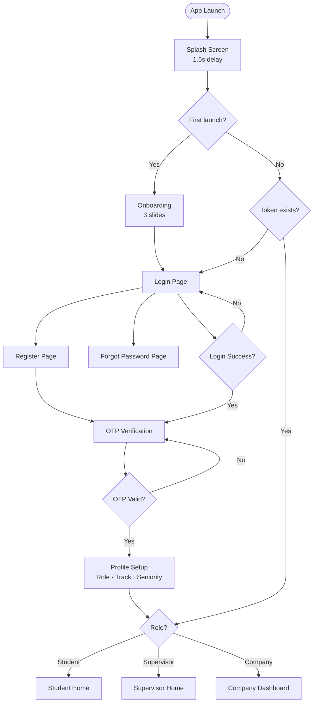
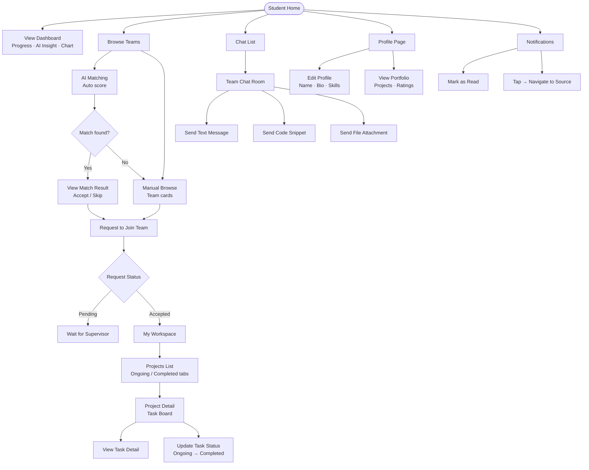
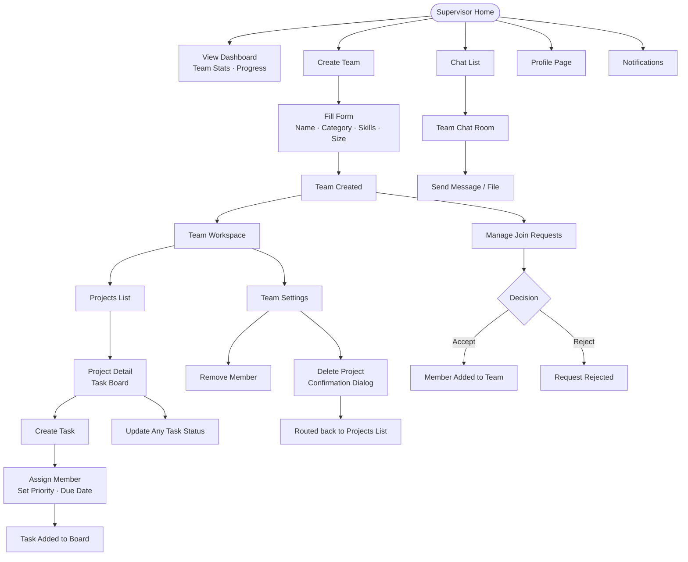
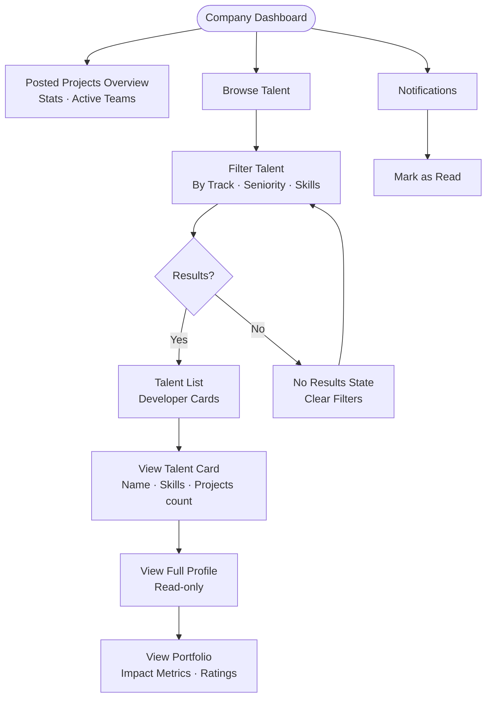

# TeamUP — Flutter Implementation Plan (Final)

## ✅ Technical Decisions (Locked)

| Concern | Decision |
|---|---|
| **Architecture** | Clean Architecture — `data → domain → presentation` |
| **State Management** | Bloc / Cubit |
| **File Structure** | Feature-First + Shared `core/` |
| **Navigation** | `go_router` |
| **Dependency Injection** | `get_it` |
| **Networking** | `dio` |
| **Real-time (Chat)** | `web_socket_channel` |
| **Responsive UI** | `flutter_screenutil` on every widget |
| **Local Storage** | `sqflite` — structured local data, caching |

---

## 🏛️ Architecture Rules

| Rule | Detail |
|---|---|
| **SOLID** | Every class has one reason to change — no fat classes |
| **Entities** | Pure Dart — no Flutter, no JSON, no annotations |
| **Models** | Extend entity + `fromJson` / `toJson` |
| **Repository interface** | In `domain/` — abstract only |
| **Repository impl** | In `data/` — concrete, implements domain interface |
| **UseCase** | One action per class, returns `Either<Failure, T>` via `dartz` |
| **Bloc/Cubit scope** | Presentation only — no data/domain imports in pages |
| **`get_it`** | Only place `new` keyword lives for dependencies |
| **`go_router`** | All navigation — zero `Navigator.push()` anywhere |
| **`buildWhen`** | Use only when a Bloc emits multiple states and only some require a UI rebuild |
| **Static Bloc access** | `context.read<Bloc>().add(...)` for triggering events — not inside `build()` |
| **Responsive UI** | Every size uses `.w`, `.h`, `.sp` from `flutter_screenutil` |
| **Clean code** | No magic numbers, no unused imports, all names are meaningful |
| **Follow Figma** | UI must match Figma exactly — no custom/invented UI |
| **Dark-mode ready** | Colors defined via `ThemeExtension<AppColorScheme>` — `copyWith` + `lerp` support built-in |

---

## 🎨 Design System — Extracted from Figma

### Colors

| Token | Hex | Usage |
|---|---|---|
| `primary` | `#2D4B73` | Buttons, active nav, headings |
| `primaryLight` | `#4A6CF7` | Gradient start, highlights |
| `scaffoldBg` | `#F9FAFB` | Page background (off-white) |
| `surface` | `#FFFFFF` | Cards, nav bar, inputs |
| `textPrimary` | `#111827` | Headings, body text |
| `textSecondary` | `#6B7280` | Subtitles, labels |
| `textHint` | `#9CA3AF` | Hints, disabled states |
| `ongoingBg` | `#E7F0FF` | "Ongoing" badge background |
| `ongoingText` | `#2D4B73` | "Ongoing" badge text |
| `completedBg` | `#E7F7F2` | "Completed" badge background |
| `completedText` | `#0E9F6E` | "Completed" badge text |

**Dark mode equivalents** (ready for future use):

| Token | Hex |
|---|---|
| `primary` | `#4A6CF7` |
| `scaffoldBg` | `#111827` |
| `surface` | `#1F2937` |
| `textPrimary` | `#F9FAFB` |
| `textSecondary` | `#9CA3AF` |

**Gradient:** `#4A6CF7 → #2D4B73` (onboarding, impact cards)

### Typography — Inter Font

| Token | Size | Weight | Usage |
|---|---|---|---|
| `displayLarge` | `24.sp` | Bold | Splash, onboarding titles |
| `headlineMedium` | `20.sp` | SemiBold | Page titles |
| `titleLarge` | `18.sp` | SemiBold | Card titles, section headers |
| `bodyLarge` | `16.sp` | Regular | Buttons, subheadings |
| `bodyMedium` | `14.sp` | Regular | Standard body, labels |
| `labelSmall` | `12.sp` | Regular | Badges, dates, metadata |

### Spacing (flutter_screenutil)

| Token | Value | Usage |
|---|---|---|
| `xs` | `4.w` | Tight gaps |
| `sm` | `8.w` | Small gaps |
| `md` | `16.w` | Card padding, element gaps |
| `lg` | `20.w` | Page horizontal margin |
| `xl` | `24.w` | Section gaps |
| `xxl` | `32.w` | Large sections |

### Border Radius

| Token | Value | Usage |
|---|---|---|
| `radiusCard` | `12.r` | Cards, buttons |
| `radiusCardLarge` | `16.r` | Large cards |
| `radiusPill` | `20.r` | Status badges, chips |

### Shadow

Soft shadow on white cards against off-white background: `color: black 5% opacity`, `blurRadius: 4`, `offset: (0, 4)`.

---

## 📦 Packages

| Package | Version | Purpose |
|---|---|---|
| `flutter_bloc` | `^8.1.6` | State management — Bloc pattern with Cubit support |
| `equatable` | `^2.0.5` | Value equality for entities, states, events |
| `go_router` | `^14.2.0` | Declarative routing with type-safe route configuration |
| `get_it` | `^8.0.2` | Service locator for dependency injection |
| `dio` | `^5.6.0` | HTTP client with interceptors, timeout config, multipart support |
| `pretty_dio_logger` | `^1.4.0` | Readable request/response logs — debug mode only |
| `web_socket_channel` | `^3.0.1` | WebSocket client for real-time chat |
| `dartz` | `^0.10.1` | Functional error handling — `Either<Failure, Data>` for all use cases |
| `flutter_screenutil` | `^5.9.3` | Responsive sizing — `.w` `.h` `.sp` on all widgets |
| `cached_network_image` | `^3.4.1` | Efficient network image loading with disk caching |
| `flutter_svg` | `^2.0.10+1` | SVG asset rendering |
| `shimmer` | `^3.0.0` | Skeleton loading animation while data is fetching |
| `lottie` | `^3.1.2` | Lottie animation player — onboarding, AI matching |
| `fl_chart` | `^0.69.0` | Charts — productivity stats and activity bar chart on home |
| `google_fonts` | `^6.2.1` | Inter font family — matches Figma typography |
| `shared_preferences` | `^2.3.2` | Lightweight key-value — auth token and first-launch flag only |
| `sqflite` | `^2.3.3+1` | Relational local database — offline caching |
| `path` | `^1.9.0` | Correct local file path for sqflite on each platform |
| `image_picker` | `^1.1.2` | Device image/camera picker — profile photo upload |
| `file_picker` | `^8.1.2` | Multi-type file picker — chat file attachment |
| `path_provider` | `^2.1.4` | App file system paths — file picker and attachments |
| `intl` | `^0.19.0` | Date formatting — task due dates, message timestamps |
| `connectivity_plus` | `^6.0.5` | Network connectivity detection — offline check |
| `internet_connection_checker_plus` | `^2.5.1` | Reliable active internet checker |
| `rxdart` | `^0.28.0` | Reactive stream utilities — WebSocket stream transformations |

**Dev dependencies:**

| Package | Version | Purpose |
|---|---|---|
| `bloc_test` | `^9.1.7` | Unit testing for Bloc/Cubit — emit sequence assertions |
| `mocktail` | `^1.0.4` | Mock objects for unit tests without code generation |
| `flutter_lints` | `^5.0.0` | Dart lint rules enforcing clean code style |

---

## 🗂️ File Structure

```
lib/
├── main.dart
├── app.dart
│
├── core/
│   ├── constant/
│   │   ├── app_strings.dart          ← exists, fill with all string literals
│   │   └── app_spacing.dart          ← NEW: spacing constants
│   ├── theme/
│   │   ├── app_color_scheme.dart     ← NEW: ThemeExtension with light + dark
│   │   ├── app_them.dart             ← exists, fill ThemeData
│   │   └── text_style.dart           ← exists, fill typography from Figma
│   ├── network/
│   │   ├── network_info.dart         ← exists, implement with connectivity_plus
│   │   ├── api_client.dart           ← NEW: Dio instance + interceptors
│   │   └── api_endpoints.dart        ← NEW: all URL constants
│   ├── di/
│   │   └── di.dart                   ← exists, register all core dependencies
│   ├── navigation/
│   │   ├── app_route.dart            ← exists, implement GoRouter
│   │   └── app_route_constant.dart   ← exists, fill route name constants
│   ├── error/
│   │   ├── exception.dart            ← exists, define all exception types
│   │   ├── failure.dart              ← exists, define all failure types
│   │   └── error_strings.dart        ← exists, error message constants
│   ├── helper/
│   │   ├── api/                      ← exists
│   │   ├── cache/                    ← exists, add CacheHelper (SharedPreferences)
│   │   └── database/                 ← NEW: AppDatabase (sqflite)
│   ├── usecases/
│   │   └── usecase.dart              ← NEW: abstract UseCase base class
│   ├── utils/
│   │   ├── validators.dart           ← NEW
│   │   ├── date_formatter.dart       ← NEW
│   │   ├── extensions.dart           ← NEW
│   │   └── pagination/
│   │       ├── pagination_params.dart     ← NEW (Phase 28)
│   │       ├── paginated_entity.dart      ← NEW (Phase 28)
│   │       └── paginated_model.dart       ← NEW (Phase 28)
│   └── widgets/
│       ├── bridge_app_button.dart    ← exists, implement from Figma
│       ├── app_text_field.dart       ← NEW
│       ├── app_loading.dart          ← NEW
│       ├── app_error_widget.dart     ← NEW
│       ├── app_avatar.dart           ← NEW
│       └── app_paginated_list.dart   ← NEW (Phase 28)
│
└── features/
    ├── auth/
    ├── home/
    ├── teams/
    ├── workspace/
    ├── chat/
    ├── profile/
    ├── notifications/
    └── company/
```

---

## 🗺️ User Flows

### Flow 1 — App Entry (All Roles)



---

### Flow 2 — Student Journey



---

### Flow 3 — Supervisor Journey



---

### Flow 4 — Company Journey



---

### Navigation Guard Summary

| From | Condition | Redirected To |
|---|---|---|
| Any protected route | No token | `/login` |
| `/onboarding` | `isFirstLaunch = false` | `/login` |
| `/profile-setup` | Role already set in cache | `/home` |
| `/create-team` | Role = Student | `/teams` discovery |
| `/team-settings` | Role ≠ Supervisor | `/home` |
| `/company` routes | Role ≠ Company | `/home` |
| Token expired (401) | Any API call | `/login` (via interceptor) |

---

## 🗄️ Local Database Schema (sqflite)

> All tables use `INTEGER` for booleans (0/1) and Unix timestamps (ms). Schema version starts at `1` — increment on every structural change and handle in `onUpgrade` (ALTER TABLE only — never DROP).

### Table: `users`

| Column | Type | Notes |
|---|---|---|
| `id` | TEXT PRIMARY KEY | |
| `name` | TEXT NOT NULL | |
| `email` | TEXT NOT NULL | |
| `role` | TEXT NOT NULL | `student` / `supervisor` / `company` |
| `track` | TEXT | `frontend` / `backend` / `mobile` / `ai` / `design` |
| `seniority` | TEXT | `junior` / `mid` / `senior` |
| `avatar_url` | TEXT | Nullable |
| `bio` | TEXT | Nullable |
| `cached_at` | INTEGER NOT NULL | Unix ms — used for TTL check |

### Table: `messages`

| Column | Type | Notes |
|---|---|---|
| `id` | TEXT PRIMARY KEY | |
| `room_id` | TEXT NOT NULL | Indexed with `sent_at DESC` |
| `sender_id` | TEXT NOT NULL | |
| `sender_name` | TEXT NOT NULL | |
| `sender_avatar` | TEXT | Nullable |
| `content` | TEXT NOT NULL | |
| `type` | TEXT NOT NULL | Default `text` — `text` / `code` / `file` |
| `attachment_url` | TEXT | Nullable |
| `sent_at` | INTEGER NOT NULL | Unix ms |
| `is_read` | INTEGER NOT NULL | Default `0` — `0` = unread, `1` = read |

### Table: `projects`

| Column | Type | Notes |
|---|---|---|
| `id` | TEXT PRIMARY KEY | |
| `title` | TEXT NOT NULL | |
| `status` | TEXT NOT NULL | `ongoing` / `completed` — indexed |
| `progress_percent` | INTEGER NOT NULL | Default `0` |
| `team_id` | TEXT NOT NULL | |
| `my_role` | TEXT | Current user's role on this project |
| `cached_at` | INTEGER NOT NULL | |

### Table: `tasks`

| Column | Type | Notes |
|---|---|---|
| `id` | TEXT PRIMARY KEY | |
| `project_id` | TEXT NOT NULL | Compound index with `status` |
| `title` | TEXT NOT NULL | |
| `description` | TEXT | Nullable |
| `status` | TEXT NOT NULL | `todo` / `ongoing` / `completed` |
| `priority` | TEXT NOT NULL | `low` / `medium` / `high` |
| `assignee_id` | TEXT | Nullable |
| `due_date` | INTEGER | Unix ms, nullable |
| `cached_at` | INTEGER NOT NULL | |

### Table: `notifications`

| Column | Type | Notes |
|---|---|---|
| `id` | TEXT PRIMARY KEY | |
| `type` | TEXT NOT NULL | `team_invite` / `task_assigned` / `task_updated` / `message` |
| `title` | TEXT NOT NULL | |
| `body` | TEXT NOT NULL | |
| `is_read` | INTEGER NOT NULL | Default `0` — indexed with `created_at DESC` |
| `created_at` | INTEGER NOT NULL | Unix ms |
| `meta` | TEXT | JSON string for navigation e.g. `{"teamId":"123"}` |

### Cache Strategy

| Table | TTL | Invalidation |
|---|---|---|
| `users` | 30 min | On profile update or logout |
| `messages` | Persistent | New messages appended; older pages on scroll |
| `projects` | 15 min | On pull-to-refresh or status change |
| `tasks` | 15 min | On task status update |
| `notifications` | Persistent | Cleared on logout |

> `isCacheStale(cachedAt, ttlMinutes)` — helper in `core/utils/` that checks if `now - cachedAt > ttl * 60 * 1000`.

---

## 🚀 Implementation Phases

---

### Phase 0 — Packages Setup
**Goal:** Add all packages to pubspec.yaml, verify the project builds.
**UI Screen Required:** No

- [x] Add all packages listed above to `pubspec.yaml`
- [x] Run `flutter pub get` — zero errors
- [x] Verify `assets/images/` and `assets/svg/` sections registered

#### ⚠️ Edge Cases
| Scenario | Handling |
|---|---|
| Package version conflict | Run `flutter pub deps` to inspect the dependency tree; pin exact versions if needed |
| `flutter pub get` fails | Verify `environment.sdk` constraint matches installed Flutter SDK version |
| Asset folder missing | Create `assets/images/` and `assets/svg/` directories before running pub get |
| SDK constraint mismatch | Update `sdk: ^3.x.x` in `pubspec.yaml` to match current Flutter SDK |

**Deliverable:** Clean project with all packages installed.

---

### Phase 1 — Design System & Theme
**Goal:** Fill all empty theme files using Figma tokens exactly as extracted above.
**UI Screen Required:** No

- [x] `core/theme/app_color_scheme.dart` — implement `AppColorScheme extends ThemeExtension<AppColorScheme>` with `light` and `dark` static const instances, `copyWith`, and `lerp` overrides (see Design System section for all hex values)
- [x] `core/theme/text_style.dart` — Inter font, full hierarchy using `.sp` for all sizes
- [x] `core/theme/app_them.dart` — build `ThemeData` with `extensions: [AppColorScheme.light]`; dark theme with `extensions: [AppColorScheme.dark]`; pass both to `MaterialApp.router` with `ThemeMode.system`
- [x] `core/constant/app_spacing.dart` — spacing and border radius constants from Figma
- [x] `core/constant/app_strings.dart` — fill all string literals used across the app
- [x] `app.dart` — `MaterialApp.router` wrapped in `ScreenUtilInit` (design size: `390×844`), theme applied

#### ⚠️ Edge Cases
| Scenario | Handling |
|---|---|
| Google Fonts fails (no internet on first launch) | Add Inter font as a local asset in `pubspec.yaml` as fallback — never rely on network for fonts |
| `ScreenUtilInit` not wrapping `MaterialApp` | App crashes on `.w`/`.h`/`.sp` — ensure `ScreenUtilInit` is the root widget in `app.dart` |
| `ThemeData` not applied globally | Wrap every test with `MaterialApp(theme: AppTheme.light)` to avoid null theme errors in widget tests |
| Wrong design size set in `ScreenUtilInit` | All sizes will be off — design size must match Figma frame: `width: 390, height: 844` |

**Deliverable:** Design system ready — all Figma tokens available, `context.colors.*` and `context.*TextStyle` ready for use.

---

### Phase 2 — Core: Error Handling & UseCase Base
**Goal:** Build the error layer and base UseCase contract.
**UI Screen Required:** No

- [x] `core/error/exception.dart` — define `ServerException`, `CacheException`, `NetworkException`, `UnauthorizedException` — all with `required named message` parameter and `Equatable` props
- [x] `core/error/failure.dart` — define `ServerFailure`, `NetworkFailure`, `CacheFailure`, `UnauthorizedFailure` all extending abstract `Failure extends Equatable`
- [x] `core/error/error_strings.dart` — constant error message strings
- [x] `core/usecases/usecase.dart` — abstract `UseCase<Type, Params>` with `call({required Params params})` returning `Either<Failure, Type>`; also define `NoParams extends Equatable`

#### ⚠️ Edge Cases
| Scenario | Handling |
|---|---|
| Unknown exception type not caught | Add `UnknownFailure` as catch-all in every `RepositoryImpl` catch block |
| `UseCase` called with wrong `Params` type | Dart's type system catches this at compile time — never use `dynamic` for params |
| Null API response body | `ServerException` with `ErrorStrings.nullResponse` — never call `.!` on nullable response data |
| `Failure` compared without `props` | All `Failure` subclasses must override `props` via `Equatable` — required for `BlocTest` assertions |

**Deliverable:** Failure hierarchy + UseCase base class available for all features.

---

### Phase 3 — Core: Network Client (Dio)
**Goal:** Fully configured Dio instance with auth and error interceptors.
**UI Screen Required:** No

- [x] `core/network/network_info.dart` — implement using `internet_connection_checker_plus`
- [x] `core/network/api_endpoints.dart` — all URL constants as `static const String` (stubs until backend ready)
- [x] `core/network/api_client.dart`:
  - Dio instance with base URL, timeouts (`connectTimeout: 30s`, `receiveTimeout: 30s`)
  - `AuthInterceptor` — reads token from `CacheHelper`, attaches as `Authorization: Bearer <token>`
  - `ErrorInterceptor` — maps HTTP status codes → typed exceptions (`401 → UnauthorizedException`, `5xx → ServerException`)
  - `pretty_dio_logger` added only in debug mode
- [x] `core/helper/cache/cache_helper.dart` — `SharedPreferences` wrapper with:
  - `saveToken(String)`, `getToken()`, `deleteToken()`
  - `saveUserRole(String)`, `getUserRole()`
  - `setFirstLaunch(bool)`, `isFirstLaunch()`

#### ⚠️ Edge Cases
| Scenario | Handling |
|---|---|
| No internet connection | `NetworkInfo.isConnected` checked in every `RepositoryImpl` before API call → `Left(NetworkFailure())` |
| Token expired (401) | `AuthInterceptor` catches 401 → clears token via `CacheHelper` → emits router refresh signal → redirect to `/login` |
| Request timeout | `DioExceptionType.connectionTimeout` / `receiveTimeout` caught → `Left(NetworkFailure())` |
| Server error (5xx) | `ErrorInterceptor` maps 5xx → `ServerException(message: ErrorStrings.serverError)` |
| Malformed JSON response | `FormatException` caught in `RemoteDataSource` → throw `ServerException(message: ErrorStrings.parseError)` |
| `CacheHelper` write fails | Wrap all `SharedPreferences` writes in try-catch → log error, continue gracefully |

**Deliverable:** `ApiClient` ready — all future datasources use `sl<ApiClient>()`.

---

### Phase 4 — Core: Router & DI Shell
**Goal:** Wire `go_router` and register all core singletons in `get_it`.
**UI Screen Required:** No

- [x] `core/navigation/app_route_constant.dart` — all route paths as `static const String`: `/`, `/onboarding`, `/login`, `/register`, `/otp`, `/forgot-password`, `/profile-setup`, `/home`, and all feature routes
- [x] `core/navigation/app_route.dart` — `GoRouter` configuration:
  - `redirect` guard: check token + role → appropriate entry point
  - Stub routes returning empty `Scaffold` for all unbuilt pages
  - `StatefulShellRoute` for bottom navigation shell (added in Phase 13)
- [x] `core/di/di.dart` — register core with category comments:
  - `// ─── Local Storage` — `SharedPreferences`, `CacheHelper`
  - `// ─── Network` — `NetworkInfo`, `ApiClient`
  - Feature DI sections follow: `// ─── Data Sources`, `// ─── Repositories`, `// ─── Use Cases`, `// ─── Bloc / Cubit`
- [x] `main.dart` — `await initDi()` before `runApp()`

#### ⚠️ Edge Cases
| Scenario | Handling |
|---|---|
| `sl<T>()` called before `initDi()` completes | `await initDi()` is strictly the first call in `main()` — never call `sl<>()` at class-level |
| Route not found (typo in path) | `GoRouter.errorBuilder` renders a branded "Page not found" screen, never crashes |
| Protected route accessed by wrong role | `redirect` guard in `GoRouter` reads role from `CacheHelper` and redirects to the correct entry point |
| Deep link with invalid path | `GoRouter` catches unknown paths via `errorBuilder` |
| `SharedPreferences` not initialized before DI | `await SharedPreferences.getInstance()` is always first in `initDi()` before any other registration |

**Deliverable:** App starts, routing redirects correctly, DI shell initialized.

---

### Phase 5 — Core: Extensions, Color Schema & Shared Widgets
**Goal:** Create `BuildContext` extensions for colors and text styles so every feature accesses the design system through `context`. Build the shared widget library from Figma.
**UI Screen Required:** Yes — shared component screens (AppButton, AppTextField, AppAvatar, AppLoading, AppErrorWidget)

#### 5a — AppColorScheme as ThemeExtension
- [x] `core/theme/app_color_scheme.dart` — `AppColorScheme extends ThemeExtension<AppColorScheme>`:
  - All color fields as `required` named constructor parameters
  - `static const light` — all Figma light-mode hex values
  - `static const dark` — all dark-mode hex values (ready for future)
  - `copyWith` override — all fields nullable, full fallback to `this`
  - `lerp` override — `Color.lerp` on every field for smooth theme transitions
- [x] `core/theme/app_them.dart` — `lightTheme` with `extensions: [AppColorScheme.light]`, `darkTheme` with `extensions: [AppColorScheme.dark]`
- [x] `app.dart` — `theme: lightTheme`, `darkTheme: darkTheme`, `themeMode: ThemeMode.system`

#### 5b — BuildContext Color Extension (API unchanged)
- [x] `core/utils/extensions.dart` — `AppColorScheme get colors` on `BuildContext`, reads via `Theme.of(this).extension<AppColorScheme>()!`
  - **Usage:** `context.colors.primary` — identical API, zero feature code changes when dark mode is toggled
  - Enforced: no feature file imports `AppColorScheme` directly — always via `context.colors.*`

#### 5c — BuildContext Text Style Extension
- [x] `core/utils/extensions.dart` — `displayLarge`, `headlineMedium`, `titleLarge`, `bodyLarge`, `bodyMedium`, `labelSmall` getters on `BuildContext`, all reading from `Theme.of(this).textTheme.*!`
  - **Usage:** `context.headlineMedium` — never `AppTextStyles.headlineMedium` directly

#### 5d — Other BuildContext Utilities
- [x] `core/utils/extensions.dart` — `showSnackBar(String)`, `screenWidth`, `screenHeight` on `BuildContext`
- [x] `core/utils/extensions.dart` — `capitalize` getter on `String`

#### 5e — Shared Widgets (strictly from Figma)
- [x] `bridge_app_button.dart` — primary and secondary variants; uses `context.colors.primary`; border radius `12.r`; height `52.h`; loading state replaces label with `CircularProgressIndicator`
- [x] `app_text_field.dart` — fill `context.colors.surface`; subtle border; radius `12.r`; padding `16.w`×`14.h`; uses `context.bodyMedium`
- [x] `app_loading.dart` — centered `CircularProgressIndicator` using `context.colors.primary`
- [x] `app_error_widget.dart` — error icon + message + retry button (from Figma empty/error states)
- [x] `app_avatar.dart` — `CachedNetworkImage` in circle; fallback to initials on solid color background
- [x] `core/utils/validators.dart` — email, password (min 8 chars, 1 uppercase, 1 number), required field validators
- [x] `core/utils/date_formatter.dart` — format timestamps for messages and task due dates

> [!IMPORTANT]
> **Enforcement rule:** Every feature — without exception — accesses colors via `context.colors.*` and text styles via `context.headlineMedium` etc. No feature file may import `AppColors` or `AppTextStyles` directly. All design values flow through `BuildContext` extensions defined in `core/utils/extensions.dart`.

#### ⚠️ Edge Cases
| Scenario | Handling |
|---|---|
| `CachedNetworkImage` broken/null URL | `AppAvatar` `errorWidget` renders initials on a solid color background — never shows broken image |
| Button double-tap (spam) | `AppButton` disables itself while `isLoading == true` — `onPressed: isLoading ? null : callback` |
| Keyboard overlaps text fields | All scaffolds that contain forms must set `resizeToAvoidBottomInset: true` |
| `TextTheme` slot is null | All `context.headlineMedium` etc. are `!` — ensure every slot is defined in `AppTheme.textTheme` in Phase 1 |
| Extension conflict (two extensions define same getter) | Keep all `BuildContext` extensions in a single file `extensions.dart` to prevent conflicts |

**Deliverable:** `BuildContext` color + text style extensions live in `core/`. Every future feature widget uses `context.colors.*` and `context.*TextStyle` — zero direct design class imports outside core.

---

### Phase 6 — Splash Screen
**Goal:** Branded splash screen that checks auth state and redirects.
**UI Screen Required:** Yes — Splash screen

> **Figma:** Centered logo on `#F9FAFB` background with app name "TeamUP"

- [ ] `features/auth/presentation/pages/splash_page.dart`
  - Display app logo from `assets/images/` centered on `scaffoldBg`
  - App name text using `displayLarge` style, color `context.colors.primary`
  - Short delay (1.5s) then let `go_router` redirect handle navigation
  - No business logic in the page itself — redirect handled by router guard

#### ⚠️ Edge Cases
| Scenario | Handling |
|---|---|
| Token exists but is expired | `AuthInterceptor` handles 401 on first protected call → clears token → redirects to `/login` |
| `SharedPreferences` read fails | Treat as unauthenticated — router guard defaults to `/login` on any read exception |
| App logo asset missing | Provide a text fallback (app name styled with `displayLarge`) until asset is added |
| Splash shows for too long (slow device) | Cap delay to 1500ms regardless of device speed |

**Deliverable:** Branded splash screen, auto-redirects via router.

---

### Phase 7 — Onboarding
**Goal:** 3-slide onboarding flow that only appears on first launch.
**UI Screen Required:** Yes — Onboarding slides (all 3)

> **Figma:** Full-screen slides with Lottie animation top half, title + subtitle bottom half, dot indicator, "Skip" top-right, "Get Started" / "Next" primary button. Final slide shows "Get Started".

- [x] `features/auth/presentation/pages/onboarding_page.dart`
  - `PageController` with 3 slides
  - Dot indicator matching Figma style
  - "Skip" button navigates directly to `/login`, writes `isFirstLaunch = false`
  - "Get Started" on final slide navigates to `/login`, writes `isFirstLaunch = false`
  - Lottie animations from `assets/` for each slide
  - Title: `titleLarge` style
  - Subtitle: `bodyMedium`, `context.colors.textSecondary`

#### ⚠️ Edge Cases
| Scenario | Handling |
|---|---|
| Back button pressed on slide 1 | Use `PopScope(canPop: false)` on onboarding page — back button does nothing or exits app |
| App killed mid-onboarding | `isFirstLaunch` flag is only written `false` after "Get Started" — safe to show onboarding again |
| Lottie file fails to load | Show static image fallback from `assets/images/` — never show empty white space |
| User taps Skip very fast | `PageController` handles it gracefully — write `isFirstLaunch = false` before navigating |

**Deliverable:** Onboarding runs once on first launch, matches Figma exactly.

---

### Phase 8 — Auth: Login
**Goal:** Login screen matching Figma design, connected to `LoginCubit`.
**UI Screen Required:** Yes — Login screen

> **Figma:** "Welcome Back" heading, email + password fields, "Forgot Password?" link, primary CTA button, social login row (Google / GitHub / Apple icons), "Don't have an account? Register" link.

- [ ] **Domain**
  - `user_entity.dart` — `id`, `name`, `email`, `role`, `track`, `seniority`, `token`
  - `auth_repository.dart` (abstract) — `login` method
  - `login_usecase.dart` → `Either<Failure, UserEntity>`; `LoginParams` with `required named` email + password
- [ ] **Data**
  - `user_model.dart` — extends `UserEntity`, `fromJson` / `toJson`
  - `auth_remote_datasource.dart` — Dio call to login endpoint
  - `auth_local_datasource.dart` — save/read token via `CacheHelper`
  - `auth_repository_impl.dart`
- [ ] **Presentation** — `LoginCubit` (NOT a shared AuthBloc):
  - States: `LoginInitial`, `LoginLoading`, `LoginSuccess({required user})`, `LoginFailure({required message})` — all `sealed`, all `Equatable`
  - `login()` method with `required named` email + password
  - `login_page.dart` — `BlocConsumer<LoginCubit, LoginState>`:
    - `listener`: navigate on `LoginSuccess`, show `SnackBar` on `LoginFailure`
    - `buildWhen`: rebuild only for `LoginLoading` / `LoginInitial` (button state)
    - Email `AppTextField`, password `AppTextField` with eye toggle
    - Primary `AppButton` — shows loader when state is `LoginLoading`
    - Social login buttons — UI only
  - Register in `di.dart` under `// ─── Use Cases` and `// ─── Cubit`

#### ⚠️ Edge Cases
| Scenario | Handling |
|---|---|
| Wrong credentials (400/401) | `LoginFailure` state → `SnackBar` with server message; form stays, no navigation |
| Network down during login | `NetworkFailure` → `SnackBar` "No internet connection"; retry by tapping login again |
| Double-tap submit | `AppButton` disabled during `LoginLoading` — no double requests |
| Empty fields submitted | `Form.validate()` blocks submission before any API call |
| Email not verified (403) | `ServerFailure` with specific message → SnackBar prompts user to check email |

**Deliverable:** Login screen, Figma-accurate, connected to `LoginCubit`.

---

### Phase 9 — Auth: Register
**Goal:** Registration screen matching Figma, connected to `RegisterCubit`.
**UI Screen Required:** Yes — Register screen

> **Figma:** "Create Account" heading, name + email + password + confirm password fields, primary CTA, "Already have an account? Login" link.

- [ ] **Domain** — add `register` to `AuthRepository`, `RegisterUseCase`; `RegisterParams` with `required named` name, email, password
- [ ] **Data** — `register` in `AuthRemoteDataSource` + impl
- [ ] **Presentation** — `RegisterCubit`:
  - States: `RegisterInitial`, `RegisterLoading`, `RegisterSuccess`, `RegisterFailure({required message})` — all `sealed`, `Equatable`
  - `register()` method with `required named` name, email, password
  - `register_page.dart` — 4 fields: full name, email, password, confirm password
    - Form validation using `validators.dart`
    - `buildWhen`: rebuild only for `RegisterLoading` / `RegisterInitial`
    - On `RegisterSuccess` → navigate to `/otp`
  - Register in `di.dart`

#### ⚠️ Edge Cases
| Scenario | Handling |
|---|---|
| Email already exists (409) | `ServerFailure` with "Email already in use" message displayed as `SnackBar` |
| Password ≠ confirm password | `FormFieldValidator` catches mismatch before API call; no network request fired |
| Password too weak | `validators.dart` enforces min 8 chars, 1 uppercase, 1 number; shown inline under field |
| Network failure | `NetworkFailure` → `SnackBar`; button re-enabled immediately |

**Deliverable:** Register screen, Figma-accurate, connected to `RegisterCubit`.

---

### Phase 10 — Auth: OTP Verification
**Goal:** OTP verification screen matching Figma, with countdown resend, connected to `OtpCubit`.
**UI Screen Required:** Yes — OTP verification screen

> **Figma:** "Enter OTP" heading, subtitle with email masked, 6 individual digit boxes in a row, countdown timer, "Resend Code" text button.

- [ ] **Domain** — `VerifyOtpUseCase`, `ResendOtpUseCase`; `OtpParams` with `required named` code
- [ ] **Data** — add to `AuthRemoteDataSource` + impl
- [ ] **Presentation** — `OtpCubit`:
  - States: `OtpInitial`, `OtpLoading`, `OtpSuccess`, `OtpResendSuccess`, `OtpFailure({required message})` — all `sealed`, `Equatable`
  - `verifyOtp({required String code})` and `resendOtp()` methods
  - `otp_verification_page.dart`:
    - 6 individual `TextField` boxes with auto-focus and auto-advance
    - Timer: 60s countdown in an **isolated `StatefulWidget`** — does NOT use `OtpCubit`
    - `buildWhen`: rebuild only for `OtpLoading`, `OtpInitial`, `OtpFailure`
    - On `OtpSuccess` → navigate to `/profile-setup`

#### ⚠️ Edge Cases
| Scenario | Handling |
|---|---|
| Wrong OTP entered | `OtpFailure` → shake animation on boxes + "Invalid code" `SnackBar`; clear all boxes |
| OTP expired (server 410) | `OtpFailure` → "Code expired" `SnackBar`; timer resets, "Resend" button becomes active |
| Resend request spam | Resend button disabled during `OtpLoading`; re-enabled after response |
| Network failure during verify | `NetworkFailure` → `SnackBar`; OTP boxes retain entered digits |
| User navigates back | OTP is invalidated on server if user re-registers — handled by server |

**Deliverable:** OTP screen with 6-box input and resend timer, connected to `OtpCubit`.

---

### Phase 11 — Auth: Forgot Password
**Goal:** Password recovery screen matching Figma, connected to `ForgotPasswordCubit`.
**UI Screen Required:** Yes — Forgot Password screen

> **Figma:** "Reset Password" heading, subtitle instruction, email field, "Send Reset Link" primary button, back arrow navigation.

- [ ] **Domain** — `ForgotPasswordUseCase`; `ForgotPasswordParams` with `required named` email
- [ ] **Data** — add to `AuthRemoteDataSource`
- [ ] **Presentation** — `ForgotPasswordCubit`:
  - States: `ForgotPasswordInitial`, `ForgotPasswordLoading`, `ForgotPasswordSuccess`, `ForgotPasswordFailure({required message})` — all `sealed`, `Equatable`
  - `sendResetLink({required String email})` method
  - `forgot_password_page.dart` — matches Figma layout
  - On `ForgotPasswordSuccess` → show Figma confirmation state inline (not navigation)

#### ⚠️ Edge Cases
| Scenario | Handling |
|---|---|
| Email not registered (404) | `ServerFailure` → "No account found with this email" `SnackBar` |
| Network failure | `NetworkFailure` → `SnackBar`; button re-enabled |
| User submits empty email | `validator` blocks submission before any API call |

**Deliverable:** Forgot password screen, Figma-accurate, connected to `ForgotPasswordCubit`.

---

### Phase 12 — Auth: Profile Setup
**Goal:** Role/track/seniority selection screen matching Figma, connected to `ProfileSetupCubit`.
**UI Screen Required:** Yes — Profile Setup steps (all 3 steps)

> **Figma:** Multi-step form with tap-to-select cards for each option. Step 1: role (Student / Supervisor / Company cards). Step 2: track (Frontend / Backend / Mobile / AI / Design). Step 3: seniority (Junior / Mid / Senior). Progress indicator at top.

- [ ] **Domain** — `SetupProfileUseCase` with `ProfileSetupParams({required role, required track, required seniority})`
- [ ] **Data** — add to `AuthRemoteDataSource`, save role to `CacheHelper`
- [ ] **Presentation** — `ProfileSetupCubit`:
  - States: `ProfileSetupInitial`, `ProfileSetupLoading`, `ProfileSetupSuccess`, `ProfileSetupFailure({required message})` — all `sealed`, `Equatable`
  - `submit({required String role, required String track, required String seniority})` method
  - `profile_setup_page.dart` — matches Figma multi-step layout:
    - Step progress indicator (top)
    - Selection cards styled per Figma (border highlight when selected, `context.colors.primary`)
    - "Continue" button disabled until selection made; advances to next step
    - On `ProfileSetupSuccess` → navigate to `/home`
  - Register in `di.dart`

#### ⚠️ Edge Cases
| Scenario | Handling |
|---|---|
| No option selected, taps Continue | "Continue" button disabled until a card is selected — validated before navigation |
| Network failure on final submit | `ProfileSetupFailure` → `SnackBar`; user stays on step 3, selection preserved |
| Role saved then app crashes | On restart, router reads role from `CacheHelper` — skips profile setup if role exists |

**Deliverable:** Profile setup working, user role saved, redirected to home. Connected to `ProfileSetupCubit`.

---

### Phase 13 — Main Shell & Bottom Navigation
**Goal:** App shell with bottom navigation bar matching Figma.
**UI Screen Required:** Yes — Main shell + Bottom navigation bar

> **Figma:** Bottom nav with 4 tabs — Home, Chat, Projects, Profile. Active tab icon uses `primary`, inactive uses `textSecondary`. White background with top shadow.

- [ ] `features/home/presentation/pages/main_shell_page.dart`
  - `StatefulShellRoute` with 4 branches in `go_router`
  - Bottom nav: items, icons, and active/inactive colors exactly from Figma
  - Company role sees different tab label/icon for "Talent" browse
  - Tab state preserved — no rebuilds when switching tabs

#### ⚠️ Edge Cases
| Scenario | Handling |
|---|---|
| Back button on root home tab | `PopScope` on `MainShellPage` — shows exit confirmation dialog or minimizes app |
| Company role accesses Student-only tab | `redirect` guard in `go_router` prevents navigation; redirects to Company's default tab |
| Tab rebuild when switching | `StatefulShellRoute` preserves each branch's state — no data re-fetch on tab switch |

**Deliverable:** App shell with Figma-accurate bottom navigation.

---

### Phase 14 — Home Dashboard
**Goal:** Home screen matching Figma dashboard design.
**UI Screen Required:** Yes — Home dashboard screen

> **Figma:** Top greeting header with user avatar. Circular progress card (tasks completion %). AI insight card with text and icon. Weekly activity bar chart. Quick action buttons: "Join Team" and "Create Team".

- [ ] **Domain** — `ProductivityStatsEntity`, `AiInsightEntity`, `HomeRepository`, 2 use cases
- [ ] **Data** — models, datasource, repository impl
- [ ] **Presentation**
  - `HomeCubit` — states: `HomeLoading`, `HomeLoaded`, `HomeError`
  - `home_page.dart` — matches Figma layout exactly:
    - Greeting header with `AppAvatar`
    - Circular progress card: `fl_chart` `PieChart`, colors from Figma
    - AI insight card: bordered card, icon + insight text
    - Bar chart: `fl_chart` `BarChart`, bar colors from `ongoingBg`/`completedBg`
    - Pull-to-refresh via `RefreshIndicator`
    - `BlocBuilder(buildWhen: (p, c) => c is HomeLoaded || c is HomeError)` — shimmer shown during `HomeLoading` independently
    - Shimmer skeleton matching Figma card shapes during initial load

#### ⚠️ Edge Cases
| Scenario | Handling |
|---|---|
| API returns empty stats (new user) | Show zero-state UI — progress = 0%, chart bars = 0 — never show loading forever |
| Partial failure (stats OK, insights fail) | Show available section — failed section renders `AppErrorWidget` with retry |
| Pull-to-refresh fails | Keep old data visible; show `SnackBar` "Failed to refresh" — don't clear existing data |
| Network down on page load | `HomeError` state → `AppErrorWidget` with retry button; shimmer replaced by error |

**Deliverable:** Home screen matching Figma exactly.

---

### Phase 15 — Teams Discovery
**Goal:** Teams browse page matching Figma.
**UI Screen Required:** Yes — Teams discovery screen + Team card

> **Figma:** Search bar at top. Horizontal filter chips: All / Frontend / Backend / Mobile / AI / Design. Vertical list of team cards: team avatar, name, member count, skills chips, "Request to Join" button.

- [ ] **Domain** — `TeamEntity`, `TeamsRepository`, `GetRecommendedTeamsUseCase`; params include `PaginationParams` (Phase 28 retrofit)
- [ ] **Data** — `TeamModel`, `TeamsRemoteDataSource`, `TeamsRepositoryImpl`
- [ ] **Presentation**
  - `TeamsBloc`: `LoadTeams`, `FilterTeams` events — states: `TeamsLoading`, `TeamsLoaded`, `TeamsError`
  - `teams_discovery_page.dart` — matches Figma layout
  - `TeamCard` — matches Figma card design
  - Filter chips from Figma design
  - Shimmer skeleton matching Figma card shape
  - `buildWhen: (p, c) => c is TeamsLoaded || c is TeamsError`

#### ⚠️ Edge Cases
| Scenario | Handling |
|---|---|
| No recommended teams (new user) | Show Figma "No Teams" empty state with "Create Team" CTA |
| Network failure on load | `TeamsError` state → `AppErrorWidget` with retry button |
| User already in a team | "Request to Join" button replaced with "Already a member" disabled state |
| User already sent a request | Button shows "Pending" disabled state — queried from entity's `requestStatus` field |

**Deliverable:** Teams discovery page matching Figma.

---

### Phase 16 — AI Matching
**Goal:** AI team matching screen matching Figma.
**UI Screen Required:** Yes — AI matching screen (loading + result states)

> **Figma:** "Find Your Team" heading, "Start Matching" button triggers matching flow. Loading state: animated Lottie + "Finding your perfect team..." text. Result: match score percentage in large circular indicator, team card with "Accept" and "Skip" buttons.

- [ ] **Domain** — `AiMatchResultEntity`, `AiMatchRepository`, `GetAiMatchUseCase`
- [ ] **Data** — `AiMatchResultModel`, datasource, impl
- [ ] **Presentation**
  - `TeamsBloc` — add `StartAiMatching` event, `AiMatchLoading`, `AiMatchResult`, `AiMatchNotFound` states
  - `ai_matching_page.dart` — matches Figma layout:
    - Lottie animation during loading
    - Circular indicator using Figma gradient colors
    - Result card from Figma design

#### ⚠️ Edge Cases
| Scenario | Handling |
|---|---|
| No match found (score = 0%) | Show Figma "No Match" result card with message + "Browse Manually" button |
| AI service timeout (> 30s) | Show timeout `AppErrorWidget` with "Try Again" button |
| Server error during matching | `TeamsError` → `AppErrorWidget`; Lottie animation stops |
| User navigates away during match | Cancel in-flight request via `Dio.CancelToken`; disconnect cleanly |

**Deliverable:** AI matching screen matching Figma.

---

### Phase 17 — Join & Create Team
**Goal:** Join request flow and team creation form matching Figma.
**UI Screen Required:** Yes — Join request bottom sheet + Create Team form

> **Figma:** "Request to Join" bottom sheet: team info, message field, "Send Request" button. Create Team form: name, category, required skills (multi-select chips), max members count.

- [ ] **Domain** — `JoinTeamUseCase`, `CreateTeamUseCase`
- [ ] **Data** — add to `TeamsRemoteDataSource` + impl
- [ ] **Presentation**
  - Add `SendJoinRequest`, `CreateTeam` events to `TeamsBloc`
  - `join_request_bottom_sheet.dart` — matches Figma bottom sheet
  - `create_team_page.dart` — form matching Figma layout
  - Route guard: create team only for Supervisor role

#### ⚠️ Edge Cases
| Scenario | Handling |
|---|---|
| Team already full | `ServerFailure` "Team is full" → `SnackBar`; bottom sheet stays open |
| Join request already sent | "Request to Join" replaced with "Pending" chip — no duplicate requests |
| Duplicate team name (409) | `ServerFailure` → inline error under team name field in create form |
| Student accesses Create Team route | Router guard redirects to `/teams` discovery page |
| Network failure on join/create | `TeamsError` → `SnackBar`; user can retry |

**Deliverable:** Join request + create team functional.

---

### Phase 18 — Projects List
**Goal:** Projects list screen matching Figma.
**UI Screen Required:** Yes — Projects list screen + Project card

> **Figma:** "My Projects" heading with tab filter: Ongoing / Completed. Project cards: title, team name, progress bar, member avatars row, status chip.

- [ ] **Domain** — `ProjectEntity`, `ProjectsRepository`, `GetProjectsUseCase`
- [ ] **Data** — `ProjectModel`, datasource, impl, sqflite cache
- [ ] **Presentation**
  - `WorkspaceBloc`: `LoadProjects`, `FilterByStatus` events — states: `ProjectsLoading`, `ProjectsLoaded`, `ProjectsError`
  - `projects_list_page.dart` — matches Figma layout
  - `ProjectCard` — matches Figma card design
  - `ProjectStatusChip` — matches Figma status chip (ongoing/completed colors from tokens)
  - Empty state: matches Figma "No Projects" illustration + CTA
  - Shimmer skeleton during load

#### ⚠️ Edge Cases
| Scenario | Handling |
|---|---|
| Empty project list | Show Figma "No Projects" empty state with "Explore Teams" CTA |
| Network failure | `ProjectsError` → `AppErrorWidget` with retry; no crash |
| Pull-to-refresh failure | Keep stale data visible; show `SnackBar` "Couldn't refresh" |
| Project deleted by supervisor while user is viewing | On next refresh, removed from list — optimistic removal not applied |

**Deliverable:** Projects list matching Figma, with tab filter.

---

### Phase 19 — Task Board
**Goal:** Task board screen matching Figma.
**UI Screen Required:** Yes — Task board screen + Task card + Task detail screen

> **Figma:** "Tasks" heading with project name subtitle. Kanban-style or list view. Task cards: title, assignee avatar, priority label chip, due date, status chip. Tap card → task detail page with full description.

- [ ] **Domain** — `TaskEntity`, `TasksRepository`, `GetTasksUseCase`, `UpdateTaskStatusUseCase`
- [ ] **Data** — `TaskModel`, datasource, impl, sqflite cache
- [ ] **Presentation**
  - Add `LoadTasks`, `UpdateTaskStatus` events to `WorkspaceBloc`
  - `task_board_page.dart` — matches Figma layout
  - `TaskCard` — matches Figma task card design
  - `TaskStatusChip` — pill chip with Figma colors (ongoing/completed from color tokens)
  - `task_detail_page.dart` — full detail view matching Figma

#### ⚠️ Edge Cases
| Scenario | Handling |
|---|---|
| Empty task list | Show Figma "No Tasks" empty state; Supervisor sees "+ Create Task" CTA |
| Task status update fails (network) | Revert optimistic UI update → show `SnackBar` "Update failed, try again" |
| Concurrent status update (409 conflict) | Show `SnackBar` "Task was updated by someone else — refresh to see latest" |
| Assignee avatar URL broken | `AppAvatar` falls back to initials |

**Deliverable:** Task board matching Figma.

---

### Phase 20 — Create Task & Supervisor Settings
**Goal:** Task creation form and supervisor settings panel matching Figma.
**UI Screen Required:** Yes — Create Task bottom sheet + Team Settings screen

> **Figma:** Create Task bottom sheet: title, description, assignee dropdown, priority chips, due date picker, "Add Task" button. Team Settings: member list with "Remove" option, delete project button.

- [ ] **Domain** — `CreateTaskUseCase`, `RemoveMemberUseCase`, `DeleteProjectUseCase`
- [ ] **Data** — add to datasources + impl
- [ ] **Presentation**
  - Add events to `WorkspaceBloc`
  - `create_task_bottom_sheet.dart` — matches Figma layout
  - `team_settings_page.dart` — matches Figma settings layout (Supervisor role only, route guarded)
  - Delete confirmation dialog — matches Figma dialog design

#### ⚠️ Edge Cases
| Scenario | Handling |
|---|---|
| No assignee selected | Form validator blocks submit with "Please select an assignee" |
| Due date in the past | `validators.dart` rejects dates before `DateTime.now()` |
| Create task fails (network) | `WorkspaceError` → `SnackBar`; form stays; data preserved |
| Delete project with active tasks | Server handles cascade; router pops to projects list after success |
| Non-supervisor accesses settings | Route guard redirects away before the page renders |

**Deliverable:** Task creation and supervisor settings panel.

---

### Phase 21 — Chat History (REST)
**Goal:** Chat list and room with REST-loaded message history, matching Figma.
**UI Screen Required:** Yes — Chat list screen + Chat room screen

> **Figma:** Chat list: room rows with avatar, room name, last message preview, unread badge, timestamp. Chat room: messages grouped by date, sent (right, primary color) vs received (left, surface color) bubbles.

- [ ] **Domain** — `ChatRoomEntity`, `MessageEntity`, `ChatRepository`, `GetChatRoomsUseCase`, `GetMessagesUseCase`
- [ ] **Data** — models, datasource, impl, sqflite cache for messages
- [ ] **Presentation**
  - `ChatBloc`: `LoadChatRooms`, `LoadMessages` events — states: `ChatLoading`, `ChatRoomsLoaded`, `MessagesLoaded`, `ChatError`
  - `chat_list_page.dart` — list of rooms matching Figma
  - `chat_room_page.dart` — message list matching Figma
  - `MessageBubble` — matches Figma: sent (right, `context.colors.primary`), received (left, `context.colors.surface`)
  - `ChatInputBar` — matches Figma input bar design

#### ⚠️ Edge Cases
| Scenario | Handling |
|---|---|
| Empty message history (new room) | Show "Start the conversation!" empty state centered in chat room |
| Network failure loading history | `AppErrorWidget` with retry; don't show empty state — differentiate from truly empty |
| Very long message | `MessageBubble` uses `maxLines` soft clamp with "Read more" expand toggle |
| Chat room with no members yet | Disable input bar; show "Waiting for members" hint text |

**Deliverable:** Chat list and room with REST history, matching Figma.

---

### Phase 22 — Real-time WebSocket
**Goal:** Connect chat room to WebSocket for live message delivery.
**UI Screen Required:** No — logic layer only, extends existing chat room UI from Phase 21

> **Figma:** Sent message appears instantly on right side. Received message appears on left side in real-time without refresh.

- [ ] **Domain** — `ConnectToChatUseCase`, `SendMessageUseCase`, `DisconnectChatUseCase`
- [ ] **Data** — `ChatWebSocketDataSource` using `web_socket_channel`; auto-reconnect with exponential backoff (max 3 attempts)
- [ ] **Presentation**
  - Add `ConnectToChat`, `SendMessage`, `MessageReceived`, `DisconnectChat` events to `ChatBloc`
  - Connect on `chat_room_page.dart` init; disconnect on page pop via `go_router` listener
  - Send button uses `context.read<ChatBloc>().add(SendMessage(...))` — no page rebuild
  - Disconnect on page pop via `go_router` listener

#### ⚠️ Edge Cases
| Scenario | Handling |
|---|---|
| WebSocket connection drops mid-session | Auto-reconnect with exponential backoff — max 3 attempts; show "Reconnecting..." banner |
| Send fails (socket closed) | Queue the message locally; retry on reconnect; show "Sending..." indicator on bubble |
| Duplicate messages (ID collision) | Deduplicate in `ChatBloc` by message `id` before adding to state list |
| App goes to background | Disconnect socket on `AppLifecycleState.paused`; reconnect on `resumed` |
| Message sent with no internet | `NetworkFailure` → message marked as "Failed" with retry icon in bubble |

**Deliverable:** Real-time bidirectional chat.

---

### Phase 23 — Rich Messages
**Goal:** Support code snippet and file attachment messages in chat, matching Figma.
**UI Screen Required:** Yes — Code snippet bubble + File attachment bubble

> **Figma:** Code bubble: monospace font block with language tag + copy icon. File bubble: file icon + filename + size + download icon. Image attachment: thumbnail in bubble, tap to open full-screen.

- [ ] **Domain** — extend `MessageEntity` with `type`, `attachmentUrl`, `fileName`, `fileSize`
- [ ] **Data** — `UploadFileUseCase`; multipart Dio call
- [ ] **Presentation**
  - `CodeSnippetBubble` — matches Figma code bubble design
  - `FileAttachmentWidget` — matches Figma file attachment design
  - Update `ChatInputBar` — attachment icon → file picker (matches Figma icons)

#### ⚠️ Edge Cases
| Scenario | Handling |
|---|---|
| File size exceeds 10 MB | Validate before upload → show `SnackBar` "File too large (max 10 MB)" |
| Unsupported file type | `file_picker` configured with allowed extensions; unsupported types blocked |
| Image attachment fails to load | `CachedNetworkImage` `errorWidget` shows file icon placeholder |
| Code paste with no language detected | Default syntax: plain text; copy icon always shown |

**Deliverable:** Rich message types matching Figma.

---

### Phase 24 — Profile View & Edit
**Goal:** Profile page matching Figma.
**UI Screen Required:** Yes — Profile view screen + Edit Profile screen

> **Figma:** Profile header: large avatar, name, role badge, track chip. Stats row: projects count, tasks completed, rating. Skills section: chips grid. "Edit Profile" button. Edit mode: in-place or separate page.

- [ ] **Domain** — `ProfileEntity`, `ProfileRepository`, `GetProfileUseCase`, `UpdateProfileUseCase`, `UploadAvatarUseCase`
- [ ] **Data** — `ProfileModel`, datasource, impl, sqflite cache
- [ ] **Presentation**
  - `ProfileCubit` — states: `ProfileLoading`, `ProfileLoaded`, `ProfileError`, `ProfileUpdating`, `ProfileUpdated`
  - `profile_page.dart` — matches Figma layout
  - `SkillChip` — pill chip matching Figma chip design
  - Edit mode — fields editable in-place or on separate page per Figma

#### ⚠️ Edge Cases
| Scenario | Handling |
|---|---|
| No avatar URL (new user) | `AppAvatar` renders initials on `context.colors.primary` background |
| Profile update fails (network) | Revert UI to previous state; show `SnackBar` "Update failed" |
| Image upload fails | Keep old avatar; show `SnackBar` "Couldn't upload photo" |
| Too many skills added | Cap at 10 skills; "+ Add Skill" button disabled beyond limit |

**Deliverable:** Profile page matching Figma.

---

### Phase 25 — Portfolio
**Goal:** Portfolio section matching Figma.
**UI Screen Required:** Yes — Portfolio card + Portfolio detail screen

> **Figma:** Portfolio cards: project name, role, impact metric (e.g. "Reduced load time by 40%"), star rating (peer rating), "Mentor Choice" badge (gold star icon). Detail page expands the card.

- [ ] **Domain** — `PortfolioItemEntity`, `GetPortfolioUseCase`
- [ ] **Data** — `PortfolioItemModel`, add to `ProfileRemoteDataSource`
- [ ] **Presentation**
  - `PortfolioCard` — matches Figma card design
  - `ImpactMetricCard` — matches Figma metric display
  - `PeerRatingWidget` — star row matching Figma rating stars
  - Mentor badge — matching Figma badge asset

#### ⚠️ Edge Cases
| Scenario | Handling |
|---|---|
| Empty portfolio (new user) | Show "No portfolio items yet" empty state with subtitle |
| Portfolio card image fails | `CachedNetworkImage` placeholder icon shown — no broken image |
| Impact metric text too long | Clamp to 2 lines with ellipsis; full text shown on `PortfolioDetailPage` |

**Deliverable:** Portfolio section matching Figma.

---

### Phase 26 — Notifications
**Goal:** Notification center matching Figma.
**UI Screen Required:** Yes — Notifications list screen + Notification tile

> **Figma:** Grouped list: "Today" / "Earlier" section headers. Notification row: icon by type (team invite = people icon, task = tick icon), title bold, body text, timestamp right-aligned. Unread dot indicator left. Badge count on bottom nav.

- [ ] **Domain** — `NotificationEntity`, `NotificationsRepository`, `GetNotificationsUseCase`, `MarkAsReadUseCase`
- [ ] **Data** — `NotificationModel`, `NotificationsRemoteDataSource`, `NotificationsRepositoryImpl`
- [ ] **Presentation**
  - `NotificationsCubit`
  - `notifications_page.dart` — grouped list matching Figma
  - `NotificationTile` — matches Figma row design
  - Unread badge on bottom nav tab icon
  - `buildWhen: (p, c) => c is NotificationsLoaded || c is UnreadCountChanged`

#### ⚠️ Edge Cases
| Scenario | Handling |
|---|---|
| Empty notification list | Show "You're all caught up! 🎉" empty state illustration |
| Mark as read fails (network) | Optimistic UI update applied immediately; silently retry in background; no visible error |
| Notification action → resource deleted | Navigate to target; catch 404 → show `SnackBar` "This item no longer exists"; pop back |
| Very old notifications (> 30 days) | Group under "Earlier" section; no special handling needed |

**Deliverable:** Notification center matching Figma.

---

### Phase 27 — Company Role: Talent Discovery
**Goal:** Company-specific screens matching Figma.
**UI Screen Required:** Yes — Company dashboard screen + Talent browse screen + Talent card

> **Figma:** Company dashboard: posted projects list, team stats. Talent browse page: filterable list of developer cards — avatar, name, top skills chips, completed projects count. Tap card → read-only profile page.

- [ ] **Domain** — `TalentEntity`, `CompanyRepository`, `GetTalentListUseCase`
- [ ] **Data** — `TalentModel`, `CompanyRemoteDataSource`, `CompanyRepositoryImpl`
- [ ] **Presentation**
  - `CompanyCubit`
  - `company_dashboard_page.dart` — matches Figma company dashboard
  - `talent_browse_page.dart` — matches Figma talent list design
  - `TalentCard` — matches Figma talent card
  - Route guard: Company role only

#### ⚠️ Edge Cases
| Scenario | Handling |
|---|---|
| Empty talent list | Show "No developers found" empty state |
| Filter returns no results | Show "No results for this filter" empty state with "Clear Filters" button |
| Talent profile not accessible (404) | `SnackBar` "Profile unavailable"; navigate back to talent list |
| Non-company role accesses company route | Router guard redirects to `/home` before page renders |
| Network failure loading talent | `AppErrorWidget` with retry; don't show empty state |

**Deliverable:** Company role fully functional, matching Figma.

---

### Phase 28 — Core: Pagination Pattern
**Goal:** Define a reusable, type-safe pagination system in `core/` and apply it to every list screen in the app.
**UI Screen Required:** No — core utility only; existing screens retrofitted, no new screens

> **Why a separate phase:** Pagination touches the domain, data, and presentation layers of 5 features simultaneously. Defining the pattern once in `core/` and retrofitting all lists ensures consistency and avoids duplicated scroll logic across features.

#### 28a — Core Pagination Utilities

- [ ] `core/utils/pagination/pagination_params.dart` — `PaginationParams extends Equatable`:
  - `required named` fields: `page`, `limit`
  - `static const defaultLimit = 20`
  - `static const first` — page 1 with default limit
  - `nextPage()` — returns new instance with `page + 1`

- [ ] `core/utils/pagination/paginated_entity.dart` — generic `PaginatedEntity<T> extends Equatable`:
  - `required named` fields: `items`, `totalCount`, `currentPage`, `totalPages`, `hasNextPage`
  - `appendPage(PaginatedEntity<T> next)` — returns new entity merging both item lists

- [ ] `core/utils/pagination/paginated_model.dart` — `PaginatedModel<T>`:
  - `fromJson(json, fromJsonT)` factory — maps `data`, `total_count`, `current_page`, `total_pages`
  - `hasNextPage` computed getter

#### 28b — Pagination State Convention

Every paginated Bloc/Cubit `Loaded` state must include:
- `items` — the current full list (previous + new page appended)
- `hasNextPage` — whether more pages exist
- `currentPage` — the last successfully loaded page
- `isLoadingMore` — `true` while the next page is in-flight (default `false`)

Two standard events added to every paginated Bloc: `LoadFirstPage` (initial load / pull-to-refresh) and `LoadNextPage` (scroll-triggered).

Guard in Bloc handler: if `state.isLoadingMore` is already `true`, ignore `LoadNextPage` to prevent duplicate requests.

#### 28c — Shared Pagination Widget

- [ ] `core/widgets/app_paginated_list.dart` — `AppPaginatedList<T> extends StatefulWidget`:
  - `required named` params: `items`, `itemBuilder`, `onLoadMore`, `hasNextPage`, `isLoadingMore`
  - Optional `onRefresh` callback (Future) — wraps in `RefreshIndicator` when provided
  - `ScrollController` — calls `onLoadMore` when scroll reaches 90% of max extent
  - Shows `AppLoading` spinner at bottom while `isLoadingMore == true`
  - When `hasNextPage == false` → shows subtle "No more items" end indicator

#### 28d — Apply to All List Screens

| Screen | Phase | Pagination Type | Page Size |
|---|---|---|---|
| Teams Discovery | 15 | Page-based (`page`, `limit`) | 20 teams |
| Projects List | 18 | Page-based | 20 projects |
| Chat History | 21 | Cursor-based (`beforeMessageId`) | 30 messages |
| Notifications | 26 | Page-based | 30 notifications |
| Talent Browse | 27 | Page-based | 20 talents |

> **Chat uses cursor-based** because messages have natural ordering by ID and new messages arrive via WebSocket — page numbers would shift and cause duplicates.

- [ ] **Teams (Phase 15 retrofit):** `GetRecommendedTeamsUseCase` params include `PaginationParams`; `TeamsBloc` gets `LoadNextPage` event + `isLoadingMore` + `hasNextPage` in `TeamsLoaded`; `teams_discovery_page.dart` replaces `ListView` with `AppPaginatedList`
- [ ] **Projects (Phase 18 retrofit):** Same pattern applied to `GetProjectsUseCase` + `WorkspaceBloc` + `projects_list_page.dart`
- [ ] **Chat History (Phase 21 retrofit):** `GetMessagesUseCase` uses `CursorPaginationParams(beforeMessageId, limit)`; load older messages when user scrolls to top of reversed list
- [ ] **Notifications (Phase 26 retrofit):** `GetNotificationsUseCase` + `NotificationsCubit` + `notifications_page.dart`
- [ ] **Talent Browse (Phase 27 retrofit):** `GetTalentListUseCase` + `CompanyCubit` + `talent_browse_page.dart` — filter params preserved across pages

#### ⚠️ Edge Cases
| Scenario | Handling |
|---|---|
| `LoadNextPage` fired while already loading | Guard in Bloc: if `state.isLoadingMore` return immediately — ignore duplicate events |
| Network fails on `LoadNextPage` | Keep existing items; show `SnackBar` "Couldn't load more"; `isLoadingMore = false` |
| Pull-to-refresh while `isLoadingMore` | Cancel/ignore `LoadNextPage`; run `LoadFirstPage` which resets page to 1 |
| Last page reached, user still scrolls | `hasNextPage == false` → `onLoadMore` never called by `AppPaginatedList` |
| Filter changes (Talent Browse) | Reset to `PaginationParams.first`; clear existing items before new fetch |
| Chat cursor: gap due to WS messages | WS messages appended to top of list in real-time; REST history loads older messages downward — no overlap |

**Deliverable:** Single reusable pagination system in `core/`. All 5 list screens use `AppPaginatedList` with consistent load-more, pull-to-refresh, and error handling behavior.

---

### Phase 29 — Testing
**Goal:** Write unit tests for all UseCases, Cubits, and Repository implementations using `bloc_test` and `mocktail`.
**UI Screen Required:** No — test files only

> **Why last:** Tests are written after each feature is stable — this phase documents the conventions and minimum coverage targets. Teams should write tests **during** each phase; Phase 29 is the final verification sweep.

#### 29a — Test Folder Structure

Mirror `lib/` exactly under `test/`:
- `test/core/network/` — error interceptor tests
- `test/core/utils/` — pagination params, validators, date formatter tests
- `test/features/auth/domain/` — `LoginUseCase`, `RegisterUseCase` tests
- `test/features/auth/data/` — `AuthRepositoryImpl` tests
- `test/features/auth/presentation/` — `LoginCubit`, `RegisterCubit`, `OtpCubit`, `ForgotPasswordCubit`, `ProfileSetupCubit` tests
- Same pattern for `home/`, `teams/`, `workspace/`, `chat/`, `profile/`, `notifications/`

#### 29b — UseCase Test Convention

For every UseCase, write tests covering:
1. **Success path** — mock repository returns `Right(entity)`; assert result equals `Right(entity)`; verify repository called exactly once; verify no more interactions
2. **Server failure** — mock returns `Left(ServerFailure)`; assert result is `Left`
3. **Network failure** — mock returns `Left(NetworkFailure)`; assert result is `Left`

Use `MockAuthRepository extends Mock implements AuthRepository` pattern via `mocktail`.

#### 29c — Cubit Test Convention

Use `blocTest<CubitType, StateType>` for every state transition:
1. **Success:** `build` returns cubit with mocked UseCase returning `Right`; `act` calls cubit method; `expect` lists `[LoadingState, SuccessState]`
2. **Failure:** same setup with `Left` return; `expect` lists `[LoadingState, FailureState]`

Always call `tearDown(() => cubit.close())`.

#### 29d — Repository Test Convention

For every `RepositoryImpl`, write tests covering:
1. **Online + success** — `networkInfo.isConnected = true`; remote returns model; assert `Right(model)`
2. **Offline** — `networkInfo.isConnected = false`; assert `Left(NetworkFailure())`; verify remote never called
3. **Remote throws `ServerException`** — assert `Left(ServerFailure(message: ...))`
4. **Remote throws `CacheException`** — assert `Left(CacheFailure(message: ...))`

#### 29e — Coverage Targets

| Layer | Minimum Coverage | Priority |
|---|---|---|
| `domain/usecases/` | **100%** | Every UseCase must have success + failure tests |
| `presentation/cubit/` | **90%** | Every state transition must be verified |
| `data/repositories/` | **80%** | Online success, offline, and exception paths |
| `core/utils/` | **80%** | Validators, pagination params, date formatter |
| `core/network/` | **70%** | Error interceptor mapping |
| `presentation/pages/` | Excluded | Widget tests out of scope for this phase |

#### ⚠️ Edge Cases
| Scenario | Handling |
|---|---|
| Mock returns unexpected type | Use `registerFallbackValue` in `setUpAll` for custom `Equatable` objects |
| Async cubit test timeout | Set `timeout` param in `blocTest` if UseCase is slow |
| `sealed class` states need no extra setup | `sealed` classes are final — no mocking needed, just instantiate |
| `NoParams` equality check | `const NoParams()` — always equal via `Equatable.props = []` |

**Deliverable:** All UseCases, Cubits, and Repositories have unit tests. `flutter test --coverage` runs clean with ≥ 85% overall coverage.

---

## 📊 Phase Summary

| Phase | Name | Category |
|---|---|---|
| **0** | Packages Setup | Foundation |
| **1** | Design System & Theme | Foundation |
| **2** | Error Handling & UseCase Base | Foundation |
| **3** | Network Client (Dio) | Foundation |
| **4** | Router & DI Shell | Foundation |
| **5** | Extensions, Color Schema & Shared Widgets | Foundation |
| **6** | Splash Screen | Auth |
| **7** | Onboarding | Auth |
| **8** | Login (`LoginCubit`) | Auth |
| **9** | Register (`RegisterCubit`) | Auth |
| **10** | OTP Verification (`OtpCubit`) | Auth |
| **11** | Forgot Password (`ForgotPasswordCubit`) | Auth |
| **12** | Profile Setup (`ProfileSetupCubit`) | Auth |
| **13** | Main Shell & Bottom Nav | Navigation |
| **14** | Home Dashboard | Home |
| **15** | Teams Discovery | Teams |
| **16** | AI Matching | Teams |
| **17** | Join & Create Team | Teams |
| **18** | Projects List | Workspace |
| **19** | Task Board | Workspace |
| **20** | Create Task & Supervisor Settings | Workspace |
| **21** | Chat History (REST) | Chat |
| **22** | Real-time WebSocket | Chat |
| **23** | Rich Messages | Chat |
| **24** | Profile View & Edit | Profile |
| **25** | Portfolio | Profile |
| **26** | Notifications | Notifications |
| **27** | Company Role | Company |
| **28** | Pagination Pattern | Core Enhancement |
| **29** | Testing (UseCases · Cubits · Repositories) | Quality |

---

> **Total: 29 focused phases** — each independently deliverable and testable.
> **Rule: Every screen must match Figma exactly — no invented UI.**
> **Auth: No shared AuthBloc — 5 independent Cubits (LoginCubit, RegisterCubit, OtpCubit, ForgotPasswordCubit, ProfileSetupCubit).**
